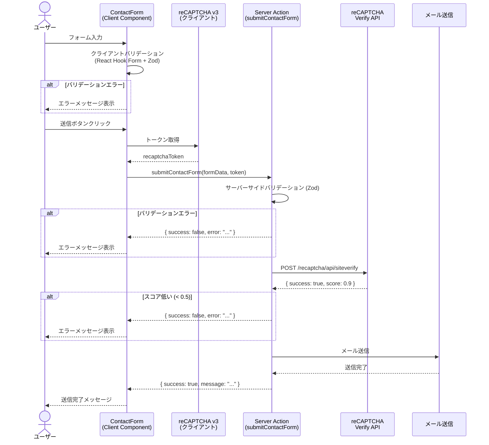

# API 設計

## Server Actions 一覧

本サイトは API Route を使わず、Server Actions でサーバーサイド処理を行う。

### 問い合わせフォーム送信

| 項目     | 内容                                                          |
| -------- | ------------------------------------------------------------- |
| ファイル | `src/app/actions/contact.ts`                                  |
| 関数名   | `submitContactForm`                                           |
| 入力     | `ContactFormData`（名前、メールアドレス、会社名、メッセージ） |
| 処理     | バリデーション → reCAPTCHA 検証 → メール送信                  |
| 出力     | `ActionResult`（成功 / エラーメッセージ）                     |

```typescript
"use server";

type ActionResult = { success: true; message: string } | { success: false; error: string };

export async function submitContactForm(
  formData: ContactFormData,
  recaptchaToken: string,
): Promise<ActionResult> {
  // 1. サーバーサイドバリデーション (Zod)
  // 2. reCAPTCHA v3 トークン検証
  // 3. メール送信
  // 4. 結果返却
}
```

## 外部 API 連携

### MVP

| API                        | 用途                      | 呼び出し元                          |
| -------------------------- | ------------------------- | ----------------------------------- |
| reCAPTCHA v3 Verify API    | フォームスパム判定        | Server Action (`submitContactForm`) |
| Google Analytics (gtag.js) | PV / イベントトラッキング | クライアントサイド                  |

### フェーズ 2

| API               | 用途                     | 呼び出し元                     |
| ----------------- | ------------------------ | ------------------------------ |
| Google Sheets API | スキル・経歴データの取得 | Claude Code Routine (ビルド時) |
| GitHub API        | リポジトリ統計の取得     | Claude Code Routine (ビルド時) |

フェーズ 2 の外部 API はランタイムでは呼ばない。Claude Code Routine がデータを取得し、コンテンツファイルを更新して PR を作成する。

## シーケンス図: 問い合わせフォーム送信



## エラーハンドリング方針

### エラー種別と対応

| エラー種別           | 対応                             | ユーザーへの表示                               |
| -------------------- | -------------------------------- | ---------------------------------------------- |
| バリデーションエラー | フィールドごとにエラーメッセージ | 入力値を修正してください                       |
| reCAPTCHA 検証失敗   | 再試行を促す                     | 送信に失敗しました。もう一度お試しください     |
| reCAPTCHA スコア低   | スパム判定として拒否             | 送信に失敗しました。もう一度お試しください     |
| メール送信失敗       | サーバーログに記録               | 送信に失敗しました。時間を置いてお試しください |
| ネットワークエラー   | クライアント側でリトライ促す     | 通信エラーが発生しました                       |

### 設計原則

- サーバー内部のエラー詳細はクライアントに返さない
- ユーザーには操作可能なメッセージ（何をすればよいか）を返す
- 全エラーをサーバーログに記録する（Vercel のログで確認可能）
- reCAPTCHA の閾値スコア（0.5）は環境変数で調整可能にする
