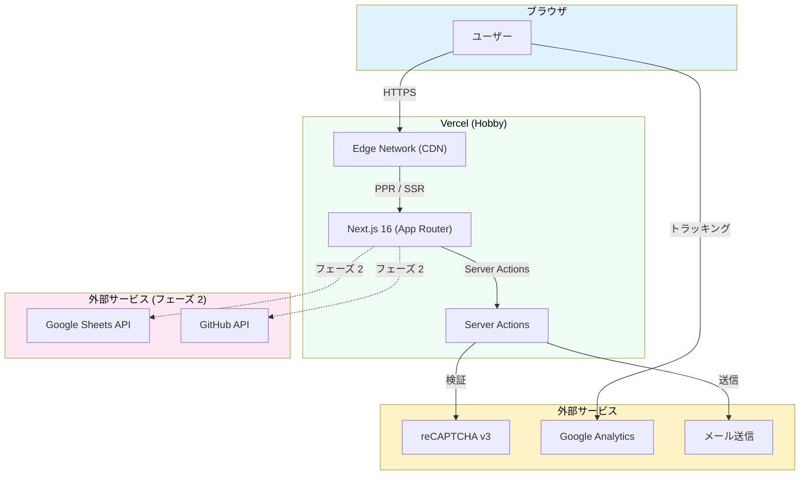
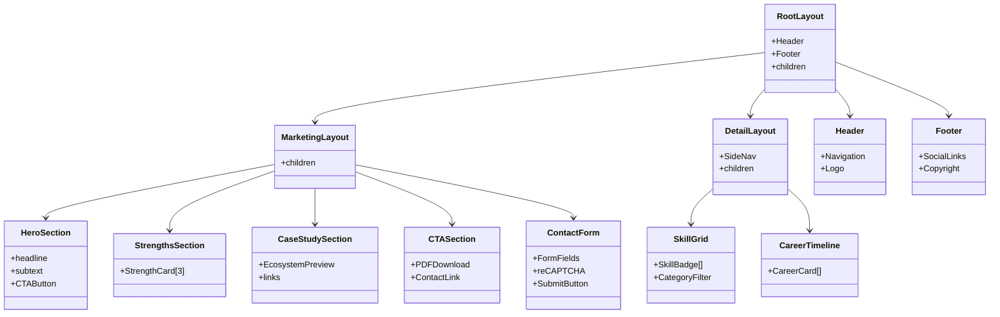

# アーキテクチャ設計

## システム構成図



## レンダリング戦略

### PPR (Partial Prerendering) + `use cache`

Next.js 16 のデフォルトレンダリング戦略を採用する。

| 要素                             | レンダリング               | 理由                                       |
| -------------------------------- | -------------------------- | ------------------------------------------ |
| 静的コンテンツ（テキスト、画像） | ビルド時プリレンダリング   | 変更頻度が低い。CDN キャッシュで高速配信   |
| 動的コンテンツ（フェーズ 2）     | `use cache` + ISR 的再検証 | 週 1 回の更新に対応                        |
| インタラクティブ要素             | Client Components          | Framer Motion アニメーション、フォーム操作 |

### Server Components vs Client Components

| 種別                            | 用途                                       | 具体例                                          |
| ------------------------------- | ------------------------------------------ | ----------------------------------------------- |
| Server Components（デフォルト） | データ取得、静的描画、レイアウト           | ページ本体、Header, Footer, セクション          |
| Client Components               | インタラクション、アニメーション、状態管理 | フォーム、ナビゲーションメニュー、Framer Motion |

Server Components をデフォルトにし、`"use client"` が必要な箇所のみ Client Components にする。React Compiler による自動メモ化で手動の `useMemo` / `useCallback` は不要。

## ルーティング設計

### Route Groups

URL 構造に影響を与えずにレイアウトを分離するために Route Groups を使う。

```
src/app/
├── (marketing)/        # LP 系: シンプルなレイアウト
│   ├── page.tsx        # / (LP)
│   └── contact/
│       └── page.tsx    # /contact
├── (detail)/           # 詳細ページ系: サイドナビ付きレイアウト
│   ├── skills/
│   │   └── page.tsx    # /skills
│   ├── career/
│   │   └── page.tsx    # /career
│   └── ai/
│       ├── page.tsx    # /ai
│       ├── ecosystem/
│       ├── agents/
│       ├── recording/
│       ├── autonomous/
│       ├── security/
│       └── sns-pipeline/
└── layout.tsx          # 共通レイアウト (Header + Footer)
```

| Route Group   | レイアウト特性                 | 対象ページ            |
| ------------- | ------------------------------ | --------------------- |
| `(marketing)` | 全幅、CTA 重視、シンプル       | LP, Contact           |
| `(detail)`    | サイドナビ付き、コンテンツ重視 | Skills, Career, AI 系 |

### 設計意図

- LP と Contact はマーケティング目的のため、余計なナビゲーションを排除してコンバージョンに集中
- Skills, Career, AI 系は情報量が多いため、サイドナビで回遊しやすくする
- 共通レイアウト（Header + Footer）は `app/layout.tsx` で全ページ共通

## コンポーネント設計

### レイヤー構成

```
src/components/
├── ui/           # shadcn/ui ベースの汎用 UI
├── layout/       # レイアウト系（Header, Footer, Navigation）
├── sections/     # LP セクション（ファーストビュー, 強み, CTA 等）
└── shared/       # 複数ページで使う共通コンポーネント
```

| レイヤー    | 責務                                           | 例                                        |
| ----------- | ---------------------------------------------- | ----------------------------------------- |
| `ui/`       | 見た目のみ。ビジネスロジックを含まない         | Button, Card, Badge, Input                |
| `layout/`   | ページ構造。ナビゲーション、ヘッダー、フッター | Header, Footer, SideNav                   |
| `sections/` | LP の各セクション。ページ固有                  | HeroSection, StrengthsSection, CTASection |
| `shared/`   | 複数ページで再利用するコンポーネント           | SkillBadge, CareerCard, SectionHeading    |

## コンポーネント構成図



## データフロー

### MVP

MVP では全コンテンツをローカルのデータファイル（TypeScript / JSON）で管理する。

```
src/lib/data/
├── skills.ts       # スキルデータ
├── career.ts       # 職務経歴データ
└── site.ts         # サイト共通情報
```

Server Components が直接データファイルを import してレンダリングする。ビルド時に静的生成される。

### フェーズ 2

外部ソースからデータを取得し、コンテンツを自動更新する。

```
Claude Code Routine (週 1 回)
  → Sheets API / GitHub API からデータ取得
  → コンテンツファイル更新
  → PR 作成
  → テスト自動実行
  → AI レビュー
  → マージ
  → Vercel 自動デプロイ
```

## ディレクトリ構成

```
src/
├── app/
│   ├── (marketing)/
│   │   ├── page.tsx            # LP
│   │   └── contact/
│   │       └── page.tsx        # /contact
│   ├── (detail)/
│   │   ├── skills/
│   │   │   └── page.tsx        # /skills
│   │   ├── career/
│   │   │   └── page.tsx        # /career
│   │   └── ai/
│   │       ├── page.tsx        # /ai (ハブ)
│   │       ├── ecosystem/
│   │       │   └── page.tsx
│   │       ├── agents/
│   │       │   └── page.tsx
│   │       ├── recording/
│   │       │   └── page.tsx
│   │       ├── autonomous/
│   │       │   └── page.tsx
│   │       ├── security/
│   │       │   └── page.tsx
│   │       └── sns-pipeline/
│   │           └── page.tsx
│   ├── actions/
│   │   └── contact.ts          # Server Action
│   └── layout.tsx              # 共通レイアウト
├── components/
│   ├── ui/                     # shadcn/ui
│   ├── layout/                 # Header, Footer, Navigation
│   ├── sections/               # LP セクション
│   └── shared/                 # 共通コンポーネント
├── lib/
│   ├── data/                   # コンテンツデータ
│   ├── utils/                  # ユーティリティ関数
│   └── validations/            # Zod スキーマ
└── styles/
    └── globals.css             # Tailwind CSS エントリーポイント
```
