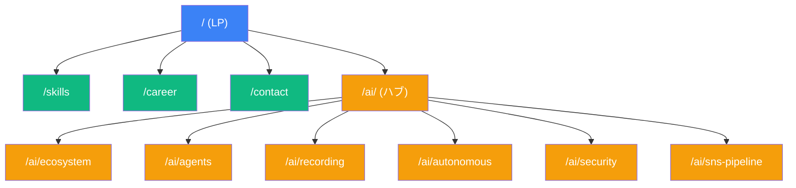

# 要件定義

## 概要

### サイトの目的

- 「AI で開発プロセス自体を設計するエンジニア」というポジショニングを数秒で伝える個人 Web サイト
- SE スキル・職務経歴・AI 活用実績を体系的に公開し、案件獲得・信頼構築につなげる
- ソースコード自体がポートフォリオとして評価される品質を維持する

### ターゲットユーザー

| ターゲット            | ニーズ                                               |
| --------------------- | ---------------------------------------------------- |
| SES / SIer の営業担当 | スキルシートの代替・補完。技術力を短時間で把握したい |
| エンジニア採用担当    | 技術スタック・経験年数・案件実績を確認したい         |
| 同業エンジニア        | AI 活用の具体的な仕組みに興味がある                  |
| 潜在的なクライアント  | 問い合わせ前に人物像・技術力を確認したい             |

## 機能要件

### ページ一覧

| パス               | ページ名         | 内容                                                     | フェーズ   |
| ------------------ | ---------------- | -------------------------------------------------------- | ---------- |
| `/`                | LP（TOP）        | ファーストビュー + 3 つの強み + ケーススタディ概要 + CTA | MVP        |
| `/skills`          | SE スキル        | 公式ロゴ + 経験年数グリッド                              | MVP        |
| `/career`          | 職務経歴         | 匿名化した案件実績                                       | MVP        |
| `/contact`         | 問い合わせ       | フォーム + reCAPTCHA v3                                  | MVP        |
| `/ai/`             | AI 活用ハブ      | AI 活用の概要ページ                                      | フェーズ 2 |
| `/ai/ecosystem`    | エコシステム     | マルチリポエコシステム全体像                             | フェーズ 2 |
| `/ai/agents`       | サブエージェント | サブエージェント構成                                     | フェーズ 2 |
| `/ai/recording`    | 記録システム     | 5 層記録システム                                         | フェーズ 2 |
| `/ai/autonomous`   | 自走モード       | 自走モードと安全設計                                     | フェーズ 2 |
| `/ai/security`     | セキュリティ     | セキュリティ設計                                         | フェーズ 2 |
| `/ai/sns-pipeline` | SNS パイプライン | SNS 自動化パイプライン                                   | フェーズ 2 |

### LP（TOP ページ）セクション

| セクション         | 内容                                                                      |
| ------------------ | ------------------------------------------------------------------------- |
| ファーストビュー   | 「AI で開発プロセス自体を設計するエンジニア」+ 一言で何者か               |
| 3 つの強み         | AI ネイティブな開発設計 / マルチエージェント品質管理 / 自己改善する仕組み |
| ケーススタディ概要 | PA エコシステムのビジュアル概観 → 各詳細ページへ                          |
| CTA                | スキルシート PDF ダウンロード + 問い合わせ導線                            |

### 問い合わせフォーム

- 入力項目: 名前、メールアドレス、会社名（任意）、メッセージ
- バリデーション: React Hook Form + Zod でクライアント・サーバー両方で検証
- スパム対策: reCAPTCHA v3 でスコア判定
- 送信処理: Server Actions でサーバーサイド処理

### PDF ダウンロード

- スキルシート PDF を CTA からダウンロード可能にする
- ダウンロード数を Google Analytics でトラッキング

## 非機能要件

### パフォーマンス

| 指標                            | 目標値                |
| ------------------------------- | --------------------- |
| LCP (Largest Contentful Paint)  | 2.5 秒以内            |
| CLS (Cumulative Layout Shift)   | 0.1 以下              |
| INP (Interaction to Next Paint) | 200ms 以内            |
| Lighthouse スコア               | 90 以上（全カテゴリ） |

- PPR + `use cache` で静的部分を事前レンダリング
- next/image で画像最適化（WebP / AVIF 自動変換）
- next/font でフォント最適化（レイアウトシフト防止）

### セキュリティ

- reCAPTCHA v3 でスパム防止
- Server Actions でフォーム処理（API エンドポイント非公開）
- HTTP セキュリティヘッダー設定（CSP, X-Frame-Options 等）
- XSS / CSRF 対策
- 環境変数で secret を管理（コードに直書きしない）

### SEO

- Next.js Metadata API + generateMetadata で各ページのメタデータ設定
- OGP 画像: Vercel OG Image Generation で動的生成（直リンク共有時のプレビュー用に維持）
- 構造化データ（JSON-LD）の埋め込み
- 検索インデックスは無効化（直リンク配布のみで運用するため `robots: Disallow: /` + `noindex`。sitemap.xml は非公開）

### アクセシビリティ

- セマンティック HTML
- キーボードナビゲーション対応
- スクリーンリーダー対応（適切な aria 属性）
- カラーコントラスト比の確保

### レスポンシブ

- デスクトップ優先 + モバイル対応
- ブレークポイント: Tailwind CSS のデフォルト（sm, md, lg, xl, 2xl）

## サイトマップ

- 青: MVP スコープ
- 緑: MVP スコープ（詳細ページ）
- 黄: フェーズ 2 スコープ

## フェーズ分け

### MVP（初回リリース）

**目的**: 最低限の情報公開 + 問い合わせ導線を確立する。

| スコープ       | 内容                                                        |
| -------------- | ----------------------------------------------------------- |
| ページ         | LP, Skills, Career, Contact の 4 ページ                     |
| 機能           | 問い合わせフォーム、PDF ダウンロード、レスポンシブ対応      |
| インフラ       | Vercel デプロイ、独自ドメイン（e2life.dev）、CI/CD          |
| テスト         | Unit / Integration / E2E / Performance / Security           |
| SEO            | メタデータ、OGP、JSON-LD（インデックスは noindex で無効化） |
| アナリティクス | Google Analytics（PV、PDF DL 数、問い合わせ数）             |

### フェーズ 2

**目的**: AI 活用の実績を体系的に公開し、差別化を強化する。

| スコープ         | 内容                           |
| ---------------- | ------------------------------ |
| ページ           | AI 活用ハブ + 6 つの詳細ページ |
| SNS パイプライン | SNS 自動化パイプラインの公開   |
